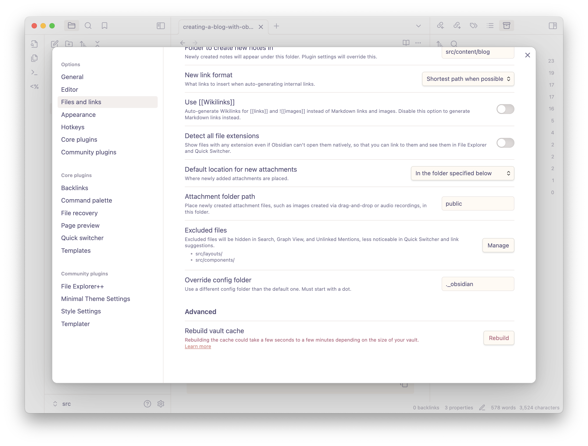

# Creating a blog with Obsidian & Astro

Let me begin by saying: this is almost certainly overkill for your purposes.

However — I have been finding myself with an odd workflow, and if there's anything I can't abide, it's doing something obnoxiously manual twice.

Here's my situation:
- I work for a Big Tech Company, which means that everything that's work related is *highly confidential.* I use Obsidian at work to take meeting notes, project notes, and jot down other confidential information that I might need to find again. 
- But I also write down things that are *career-related*, and are definitely not confidential — things I'd like to share with others or remember longer-term, such as [[how to hack together an "on-scroll" prototype]] in Figma, or how my [[idea of growth]] has evolved over time.
- As much as I love new tools, I find that Obsidian works really well for my personal journaling, too — things that are *personally confidential,* such as notes for therapy, CBT Triage notes to help me manage symptoms of anxiety, and reflections on my relationships and life.
- I read a lot and take notes on books, podcasts, YouTube videos, and articles, and I often want to reference those notes & highlights in my journals, work, and career notes.

And while my brain deeply feels the "one brain, one vault" methodology, I also absolutely can't cross the streams of confidential work or personal information. (I legally *can't* sync confidentially work information; I really *don't* want to put personal journaling on any of my work devices where tracking software can scan them, yikes.)

Oh, and in addition to that — I want to start blogging & writing publicly more, which I'd like to do via Obsidian, too. I literally never keep up with my publishing because it's so annoying to do. At home, I rarely use my laptop, and prefer to write on the go or on my iPad.

So, what's a technical girl to do?

Obviously over-engineer a solution. If you've got a similar situation to mine, I hope this helps!

My setup:

- **Personal Vault**: for any and everything personal; lives on my iPad, iPhone, and personal laptop (which I don't use much).
	- Confidential (diary, therapy notes, bullet journal, etc.)
	- → Shared [see below]
	- → Website [see below]
- **Work Vault**: for all of my work notes; lives only on my work computer.
	- Confidential (meetings, daily notes, project notes)
	- → Shared [see below]
	- → Website [see below]
- **Website Vault**: houses the content for my website.
  *Synced below the git repository so that Obsidian isn't syncing all your .git files yikes.*
	 - public → `publicDir: './my-custom-publicDir-directory'`, set Obsidian assets to this directory
	 - content
		 - blog
		 - projects
	- pages
		- About.md
		- Index.md
- **Shared Vault**: houses all the content that's not confidential and not ready for public viewing; these are usually book notes, article notes, etc, and my larger PKM "second brain." I store my notes on career growth, design, engineering, strategy, and research (as concepts/disciplines)
	- Saves → Omnivore, Readwise, Clippings
	- Non-journal notes


## Settings 
There are few settings you need to enable or change to make everything work smoothly with this setup.

1. Change the location of the `.obsidian` folder & the `attachments` folder. 
   
   Astro will try to build anything that's in your `src` folder. Since we're opening that folder as our Obsidian vault, that obviously causes some weirdness with the `.obsidian` folder, where Obsidian's themes & plugins live. Thankfully, Astro will ignore anything that begins with an underscore, even if it begins with a `._` — and Obsidian gives us the option to change its config folder location. Swap it out for `._obsidian` and you're good to go!
   
   Tip: while you're here, change the **Attachment folder path** to `public` as well — we'll be syncing Astro's public path to this later.

2. Hide folders: I use the FileExplorer++ plugin to do this, but I don't want to edit any of my Astro layouts, components, or other files in Obsidian. Just the content, please! Download the plugin, hide the folders — you're done!

```
```
